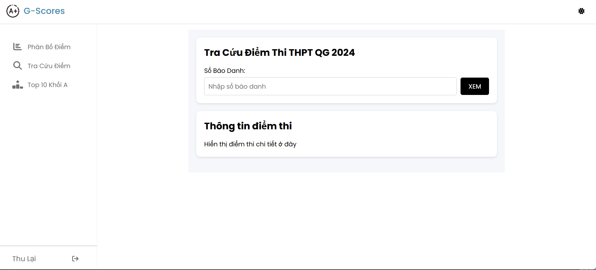
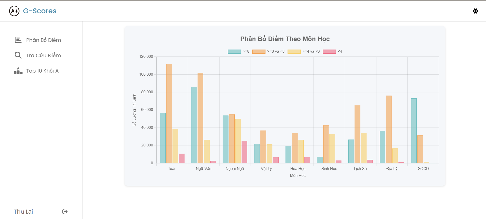
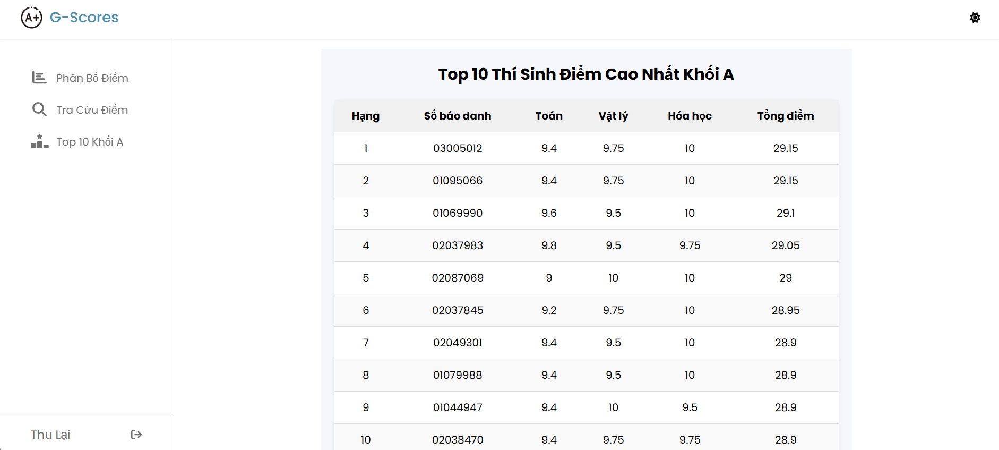

# Webdev Intern Frontend - Exam Score Lookup

## Overview
This is the frontend of a web application designed to look up exam scores for university entrance exams. The application allows users to:
- Search for their scores by entering their candidate ID (SBD).
- View score statistics by subject (chart).
- See the top 10 candidates in Block A (Math, Physics, Chemistry).

This project was developed as part of the Code Test for the Web Developer Intern position at **Golden Owl Solutions**.

## Features
- 🔍 **Score Lookup**: Users can enter their candidate ID (8 digits) to view their exam scores.
- 📊 **Score Statistics**: Displays the number of candidates in different score ranges for each subject.
- 🏆 **Top 10 Block A**: Shows the top 10 candidates with the highest total scores in Math, Physics, and Chemistry.

## Tech Stack
- **Framework**: React  
- **HTTP Client**: Axios (for API requests)  
- **Styling**: CSS  
- **Deployment**: Vercel  

## Screenshots
1. **Score Lookup Page**  
   

2. **Score Statistics Page**  
   

3. **Top 10 Block A Page**  
   

## Getting Started

### Prerequisites
- [Node.js](https://nodejs.org/) (v14 or higher)
- npm or yarn

### Installation


Install dependencies:
```bash
npm install
```
or
```bash
yarn install
```


### API Integration

This frontend connects to a backend API deployed on Railway.

Link github backend: https://github.com/Phonganbundau/webdev-intern-backend
Default API: [https://webdev-intern-backend-production.up.railway.app/]


### Deployment

The application is deployed on Vercel:
🔗 Live Demo: [https://webdev-intern-frontend.vercel.app/]
